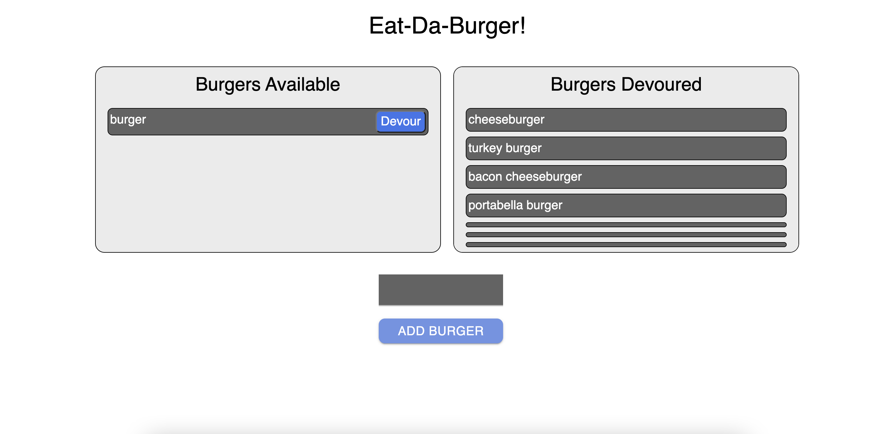

# Eat-da-burger

### Description
Used MySQL, express.js, node.js, and Handlebars to make a simple burger eating app

### Main Page

### Try it out!
* __Deployed on Heroku:__ [https://vast-oasis-44212.herokuapp.com/](https://vast-oasis-44212.herokuapp.com/)
* Enter the name ov your desired burger below, click "Add Burger".
* Your burger will be added to the available burgers column.
* Once you've eaten your burger, click the "Devour" button to move it to the devoured burgers column.
* Happy eating!